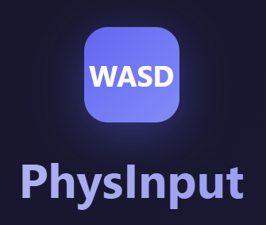
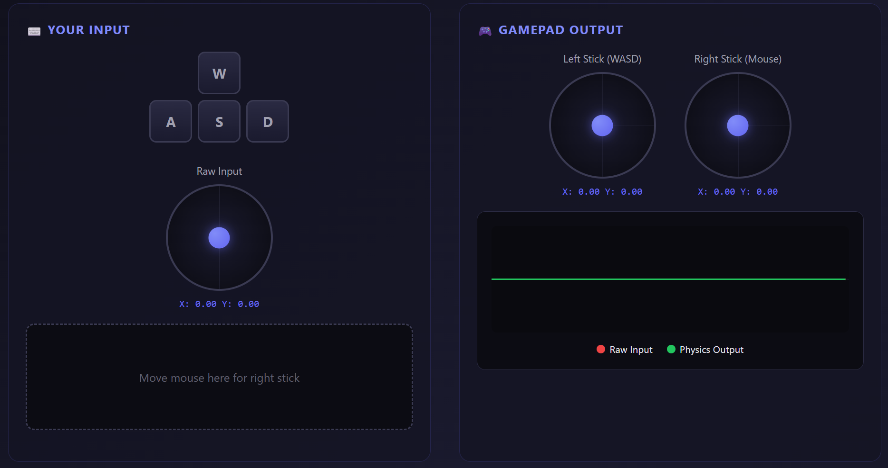

<p align="center">
  
</p>

<h1 align="center">PhysInput</h1>

<p align="center">
  <strong>Physics-Based Analog Input for Gaming</strong>
</p>

<p align="center">
  Transform your keyboard and mouse into a smooth, physics-simulated gamepad.<br>
  Perfect for accessibility, emulation, and playing controller-optimized games with KB+M.
</p>

<p align="center">
  <a href="#features">Features</a> •
  <a href="#demo">Demo</a> •
  <a href="#installation">Installation</a> •
  <a href="#usage">Usage</a> •
  <a href="#physics-models">Physics Models</a> •
  <a href="#configuration">Configuration</a> •
  <a href="#contributing">Contributing</a>
</p>

<p align="center">
  
  
  
  
</p>

---

## ⚠️ Anti-Cheat Notice

> **PhysInput creates a virtual gamepad device.** Some anti-cheat software (Easy Anti-Cheat, BattlEye, Vanguard, etc.) may detect and block virtual input devices.

**This tool is designed for:**
- ✅ **Accessibility** — Alternative input for users with motor disabilities
- ✅ **Single-player games** — Full analog control with keyboard
- ✅ **Emulators** — Native analog stick support
- ✅ **Non-competitive multiplayer** — Casual online games

**Use at your own discretion in competitive online games.** We do not condone cheating.

---

## The Problem

Keyboard keys are **binary** — pressed or not pressed. This creates jerky, all-or-nothing movement that feels unnatural in games designed for analog sticks.

<p align="center">
  
</p>

| Keyboard Input | → | PhysInput Output |
|:---:|:---:|:---:|
| `█░░░░░░░█` | | `▁▂▃▅▆█▆▅▃▂▁` |
| Binary: 0% or 100% | | Smooth: 0% to 100% |

**PhysInput bridges this gap** by running your keyboard input through physics simulations, creating natural acceleration, momentum, and deceleration — just like a real analog stick.

---

## Features

<table>
<tr>
<td width="50%">

### 🎮 Core Features
- **9 Physics Models** — Spring, critical damping, momentum, fluid dynamics, PID control, and more
- **Mouse → Right Stick** — Velocity-based mapping with configurable curves
- **Full Button Mapping** — Any key to any gamepad button
- **Diagonal Normalization** — Proper circular movement

</td>
<td width="50%">

### 🖥️ Interface
- **Modern Dark UI** — Professional PyQt6 interface
- **Real-time Visualization** — See your input transform live
- **First-run Wizard** — Easy setup for beginners
- **Input Graphs** — Monitor response curves

</td>
</tr>
<tr>
<td>

### 💾 Profiles
- **Save/Load Profiles** — Per-game configurations
- **Game Presets** — FPS, Racing, RPG, Platformer
- **Import/Export** — Share profiles with others

</td>
<td>

### ⚡ Performance
- **120+ FPS** — Low-latency input processing
- **Configurable Target FPS** — Balance CPU usage
- **Minimal Overhead** — Efficient physics calculations

</td>
</tr>
</table>

---

## Demo

Try PhysInput in your browser! The interactive demo lets you experience the physics models without installing anything.

<p align="center">
  <a href="https://htmlpreview.github.io/?https://gist.githubusercontent.com/brattzachary-bit/473027954032a010739a25cf5a1d7f2a/raw/52474cb45df759a753dbd2a4264e0893bf3bd2ba/PhysInput-Demo.html">
    
  </a>
</p>

**Or download `physinput-demo.html` and open it locally.**

<p align="center">
  
</p>

---

## Installation

### 🐧 Linux

**Requirements:** Python 3.10+, evdev, PyQt6

```bash
# Install dependencies
pip install evdev PyQt6 --break-system-packages

# Add user to input group (required for device access)
sudo usermod -aG input $USER

# ⚠️ Log out and back in for group changes to take effect

# Clone and install
git clone https://github.com/physinput/physinput.git
cd physinput/linux
pip install -e . --break-system-packages

# Run
physinput
```

<details>
<summary>📋 Troubleshooting Linux</summary>

**"Permission denied" errors:**
```bash
# Make sure you're in the input group
groups | grep input

# If not, add yourself and re-login
sudo usermod -aG input $USER
```

**No devices found:**
```bash
# Check available input devices
ls -la /dev/input/

# Verify evdev can see them
python3 -c "from evdev import list_devices; print(list_devices())"
```

</details>

---

### 🪟 Windows

**Requirements:** Python 3.10+, ViGEmBus driver, pynput, vgamepad, PyQt6

#### Step 1: Install ViGEmBus Driver

Download and install from: **[ViGEmBus Releases](https://github.com/ViGEm/ViGEmBus/releases)**

> This kernel driver enables virtual Xbox 360 and DualShock 4 controllers.

#### Step 2: Install PhysInput

```powershell
# Install dependencies
pip install pynput vgamepad PyQt6

# Clone and install
git clone https://github.com/physinput/physinput.git
cd physinput\windows
pip install -e .

# Run
physinput
```

<details>
<summary>📋 Troubleshooting Windows</summary>

**"ViGEmBus not found" errors:**
1. Download `ViGEmBus_Setup_x64.msi` from releases
2. Run installer as Administrator
3. Restart your computer
4. Try again

**Gamepad not detected in games:**
- Start PhysInput **before** launching the game
- Some games only detect controllers at startup
- Try switching between Xbox 360 and DS4 modes

</details>

---

### 🔍 Verify Installation

```bash
# Check system requirements
physinput --check
```

This will verify all dependencies and permissions are correctly configured.

---

## Usage

### Quick Start

1. **Launch PhysInput**
   ```bash
   physinput
   ```

2. **Complete the setup wizard** (first run only)
   - Configure movement keys (default: WASD)
   - Set button bindings
   - Choose physics model
   - Select controller type

3. **Click "Start"** to create the virtual gamepad

4. **Launch your game** — It will detect a new controller

5. **Press `Pause`** to toggle PhysInput on/off (configurable hotkey)

### Command Line Options

```
physinput [options]

Options:
  --check              Check system requirements and exit
  --profile NAME       Load a specific profile on startup
  --version            Show version information
  -h, --help           Show help message
```

### Default Controls

| Input | Output |
|-------|--------|
| W / A / S / D | Left Stick |
| Mouse Movement | Right Stick |
| Space | A Button |
| E | X Button |
| Q | Y Button |
| R | B Button |
| Shift | Left Bumper |
| Ctrl | Right Bumper |
| Left Click | Right Trigger |
| Right Click | Left Trigger |

*All bindings are fully customizable.*

---

## Physics Models

PhysInput includes 9 physics models, each creating a different feel:

| Model | Description | Best For |
|-------|-------------|----------|
| **Spring** | Hooke's law spring-damper system. Responsive with natural bounce. | Most games (default) |
| **Critical** | Critically damped — fastest response without overshoot. | Precision, competitive |
| **Smooth Damp** | Unity-style smooth interpolation. Butter-smooth movement. | Camera control, casual |
| **Newtonian** | F=ma physics with friction. Momentum-based movement. | Vehicles, racing |
| **Momentum** | Heavy inertial feel with thrust and drag. | Spaceships, tanks |
| **Fluid** | Viscous fluid dynamics. Like moving through water. | Underwater, relaxed |
| **PID** | Proportional-integral-derivative controller. Technical precision. | Fine-tuning enthusiasts |
| **Adaptive PID** | PID with error-dependent gain scaling. | Variable conditions |
| **Exponential** | Simple exponential smoothing. Lightweight. | Low-spec systems |

<p align="center">
  
</p>

### Tuning Parameters

Each model has adjustable parameters:

- **Stiffness** — How quickly the stick responds (higher = snappier)
- **Damping** — How much oscillation is suppressed (higher = less bounce)
- **Mass** — Inertial resistance (higher = heavier feel)
- **Return Time** — How fast the stick returns to center

---

## Configuration

### Config Location

| Platform | Path |
|----------|------|
| Linux | `~/.config/physinput/` |
| Windows | `%LOCALAPPDATA%\PhysInput\` |

### File Structure

```
config/
├── config.json          # Main configuration
├── profiles/            # Saved profiles
│   ├── fps.json
│   ├── racing.json
│   └── my-custom.json
└── presets/             # Game presets
    └── ...
```

### Example Config

```json
{
  "physics": {
    "model": "spring",
    "stiffness": 80.0,
    "damping": 12.0,
    "mass": 1.0
  },
  "mouse": {
    "enabled": true,
    "sensitivity": 1.0,
    "velocity_mode": true,
    "velocity_threshold": 2000.0
  },
  "movement_keys": {
    "up": "w",
    "down": "s",
    "left": "a",
    "right": "d"
  },
  "button_bindings": {
    "space": "BTN_SOUTH",
    "mouse_left": "RT"
  },
  "hotkey": "pause"
}
```


### Platform Backends

| Component | Linux | Windows |
|-----------|-------|---------|
| Input Capture | evdev (kernel) | pynput (user-space) |
| Output Device | uinput | ViGEmBus |
| Controller Types | Xbox 360, One, DS4, DualSense | Xbox 360, DS4 |

---

## Contributing

Contributions are welcome! Here's how you can help:

### 🐛 Reporting Bugs

1. Check existing [issues](https://github.com/physinput/physinput/issues)
2. Include your OS, Python version, and error messages
3. Describe steps to reproduce

### 💡 Feature Requests

Open an issue with the `enhancement` label describing:
- The problem you're trying to solve
- Your proposed solution
- Alternative approaches considered

### 📝 Code Style

- Python 3.10+ with type hints
- Format with `black` (line length 100)
- Lint with `ruff`
- Docstrings for public APIs

---

## Roadmap

- [x] Core physics engine
- [x] Linux support (evdev/uinput)
- [x] Windows support (ViGEmBus)
- [x] PyQt6 GUI
- [x] Profile system
- [ ] macOS support (planned)
- [ ] Tray icon / background mode
- [ ] Per-application profiles
- [ ] Gyro/accelerometer emulation
- [ ] Steam Input integration
- [ ] Haptic feedback pass-through

---

## FAQ

<details>
<summary><strong>Will this get me banned in online games?</strong></summary>

Possibly. PhysInput creates a virtual device that some anti-cheat systems detect. Use at your own risk in competitive games. We recommend single-player and accessibility use cases.

</details>

<details>
<summary><strong>Why not just use Steam Input?</strong></summary>

Steam Input is great but only works with Steam games. PhysInput works system-wide with any game, emulator, or application that supports gamepads. Additionally, Steam Input does not support physics-based keyboard to controller conversion.

</details>

<details>
<summary><strong>Can I use this for accessibility?</strong></summary>

Yes! PhysInput was designed with accessibility in mind. It allows users who can only use keyboard/mouse to play games that require analogue input. The physics smoothing also helps users with tremors or limited fine motor control.

</details>

<details>
<summary><strong>Does this add input lag?</strong></summary>

Minimal. At 120 FPS (default), the physics processing adds ~8ms of latency. You can increase the target FPS for even lower latency at the cost of slightly higher CPU usage.

</details>

<details>
<summary><strong>Can I use a different keyboard layout?</strong></summary>

Yes! All keys are fully rebindable. AZERTY, Dvorak, or any custom layout works fine.

</details>

---

## License

This project is licensed under the **MIT License** — see the [LICENSE](LICENSE) file for details.

---

## Acknowledgments

- [python-evdev](https://python-evdev.readthedocs.io/) — Linux input device interface
- [ViGEmBus](https://github.com/ViGEm/ViGEmBus) — Windows virtual gamepad driver
- [vgamepad](https://github.com/yannbouteiller/vgamepad) — Python ViGEmBus wrapper
- [pynput](https://github.com/moses-palmer/pynput) — Cross-platform input monitoring
- [PyQt6](https://www.riverbankcomputing.com/software/pyqt/) — GUI framework

---

<p align="center">
  Made with ❤️ for gamers and accessibility
</p>

<p align="center">
  <a href="https://github.com/physinput/physinput/stargazers">⭐ Star us on GitHub</a>
</p>
